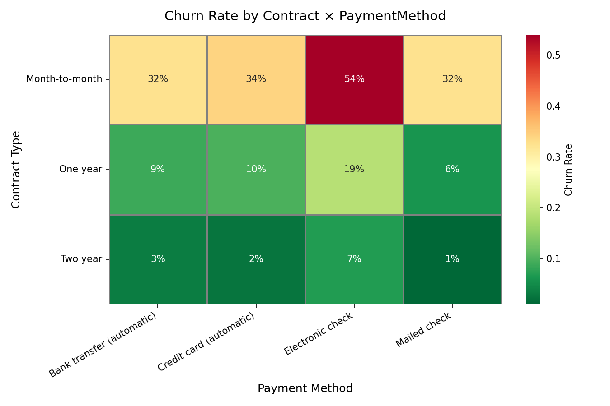

# Customer Churn – Exploratory Data Analysis (EDA) Summary

## 1. Baseline
- Overall churn rate in training data = **26.6%**  
- About 1 in 4 customers leave.

---

## 2. Top High-Risk Groups

- Fiber optic customers churn at **41.8%** (~1.6× baseline).  
- Month-to-month contracts churn at **43%** vs only **3%** for two-year contracts.  
- Electronic check users churn at **45%**, the highest of all payment methods.

---

## 3. Top Low-Risk Groups

- Two-year contracts churn at just **3%**.  
- Customers with TechSupport churn at **15%** vs 42% without it.  
- Senior citizens with long tenure are less risky than new younger customers.

---

## 4. Feature Significance (Chi-square)

- **Contract, InternetService, PaymentMethod** are the strongest churn predictors (p < 1e-100).  
- **PhoneService, Gender** show no significant impact.

---

## 5. Key Interactions
  
- 🔴 Month-to-month + Electronic check churn = **54%**  
- 🟢 Two-year + Mailed check churn = **1%**

  
- 🔴 Fiber optic + No TechSupport churn = **49%**  
- 🟢 DSL + TechSupport churn = **9%**

---

## 6. Numerical Insights

### Tenure
  
  

- 🔴 Customers in their **first 6 months churn 54%**.  
- 🟢 Customers with **5+ years tenure churn only 7%**.  
- Median tenure = **10 months (churned)** vs **38 months (retained)**.

### Monthly Charges
  
  

- 🔴 Bills **$80–95** → churn ~37%.  
- 🟢 Bills **$20–25** → churn ~9%.  
- Higher charges strongly increase churn.

### Total Charges
  
  

- 🔴 Very low lifetime spend (<$300) churns **46%**.  
- 🟢 High lifetime spend ($4500+) churns **14%**.  
- Loyal customers naturally have higher total charges.

---

## 7. Takeaways
- **Contract type, internet service, and payment method** are the strongest churn drivers.  
- **New customers with high bills** are at the greatest risk.  
- **Support services (TechSupport, OnlineSecurity)** dramatically reduce churn.  
- Retention focus:  
  - Customers in their first year.  
  - Customers on month-to-month + electronic check.  
  - Fiber optic users without support.  

---
